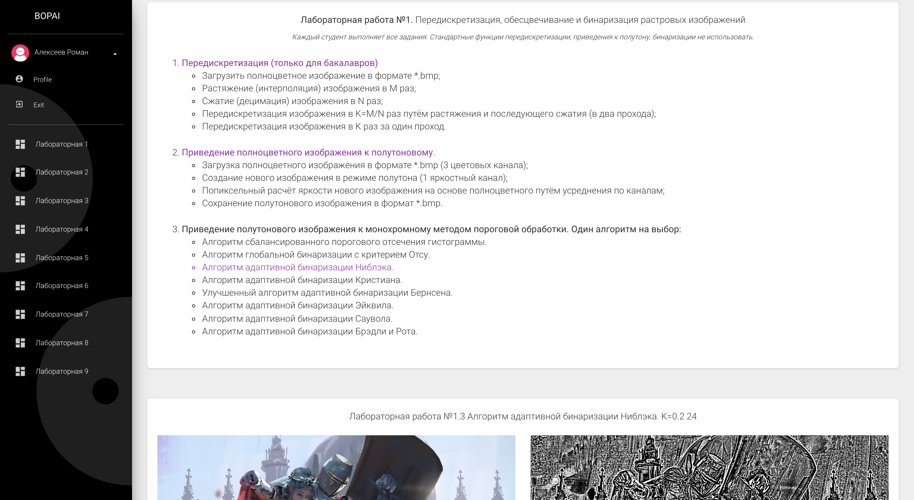
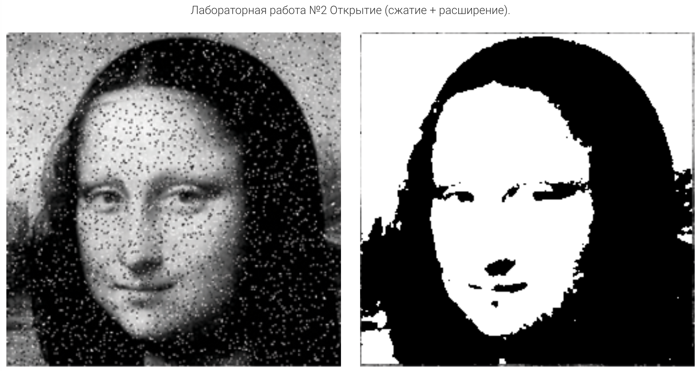
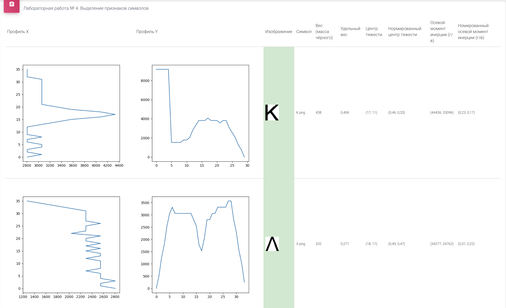

# Image Processing Django web-app

this web project was created to transfer my console applications for image processin.
Developed on the course "Fundamentals of Audiovisual Information Processing".
To a convenient web interface.

### to  run:
    git clone https://github.com/RAlekseev/img_processing.git
    python manage.py runserver

## Technologies
- Python
- Django
- PIL
- SQLite
- HTML/CSS/JS/Twig

## General regularities

- Authorized users can view processing results
- Each module (lab) displays the results of the user in that module at the bottom
- The results page contains the user's results for all modules

## (1) Resampling, desaturating and binarizing bitmaps

### Resampling

- Upload full color image in *.bmp format;
- Stretching (interpolation) of the image by M times;
- Compression (decimation) of the image by N times;
- Image resampling by K=M/N times by stretching and subsequent compression (in two passes);
- Resampling the image by a factor of K in one pass.

### Converting a full color image to grayscale.
- Loading a full-color image in *.bmp format (3 color channels);
- Creation of a new image in halftone mode (1 luma channel);
- Pixel-by-pixel calculation of the brightness of a new image based on a full-color image byaveraging over channels;
- Saving a halftone image in *.bmp format.

### Reduction of a grayscale image to monochrome by thresholding.

- Niblack's adaptive binarization algorithm.

### Results:

## (2) Image filtering and morphological operations

- A monochrome image (several pieces) is taken as input. The output is shown as:
filtered monochrome image;
- Operation of morphological opening Opening;

### Results:

## (3) Selection of contours in the image

A color or grayscale image is taken as input. The color image is reduced to grayscale. First, three gradient matrices are calculated: Gx, Gy, G. For visualization in the form of grayscale images, the matrices are normalized so that the brightness values lie from 0 to 255. Then, for the G matrix, the binarization threshold is empirically selected to obtain a contour image. Demonstrated:

Roberts 2x2 operator

- Original color image
- Halftone image
- Normalized gradient matrices Gx, Gy, G
- Binarized gradient matrix G

### Results

## (4) Feature extraction of alphabet characters

Used Greek alphabet

- Generate character reference images. It is advisable to cut off the white margins so that they do not interfere later in the laboratory work (6).

- For each image, calculate a set of features. Signs:
1. Weight (mass of black);
2. Specific gravity (weight normalized to area);
3. Coordinates of the center of gravity;
4. Normalized coordinates of the center of gravity;
5. Axial moments of inertia horizontally and vertically;
6. Normalized axial moments of inertia.
7. X and Y profiles

### Results

## (5) Text segmentation

1. Prepare text from one line
2. Implement the algorithm for calculating the horizontal and vertical profile
Images.
3. Implement an algorithm for segmenting characters in a string based on profiles with
thinning. As a result of the algorithm, an array is returned with the coordinates of the rectangles framing the characters, ordered in reading order from left to right, top to bottom.
4. Build character profiles of the selected alphabet.
5. Additionally, you can implement an algorithm for extracting lines from paragraphs and
an algorithm for detecting the bounding rectangle for the text as a whole.

### Results

## (6) Feature-based classification, profile analysis

Used Greek alphabet (4)

1. Implement the calculation of the proximity measure of symbol images based on features.
Use the Euclidean distance in the n-dimensional space of normalized features: mass, coordinates of the center of gravity, axial moments of inertia. Zero distance between images corresponds to a unit proximity measure.
2. For each detected character in the string, calculate the proximity measure with all characters of the selected alphabet. Thus, for M symbols of the recognized image, N hypotheses with proximity estimates will be obtained. The hypotheses should be sorted in descending order of proximity measure.
3. Output the results, where the i-th line will contain hypotheses for the i-th character of the recognized text. In this case, the hypotheses should be sorted in descending order of proximity, so that the most reliable hypotheses are read in the first column. For instance:
1: [("a", 0.99), ("o", 0.87), ("s", 0.78), ...] 2: [("n", 1.0), ("r", 0.77), ("p", 0.68), ...] ...
4. Output the best hypotheses (from the first column) as a string and compare with the recognizable string.
5. Conduct an experiment: Generate an image of the original string with a font size that differs from the original by several points. Recognize her. Compare Results

### Results

## (7) Texture analysis
1. Build a matrix and calculate the indicated features.
2. Visualize the constructed matrix in 256 grayscale.
3. Compare the type of matrix and features for different images.

### Results

## (8) Image enhancement. Contrasting

1. Implement the method of power transformation of the transfer function;
2. After implementing the method, apply the method pixel by pixel to the color image.
3. Conduct an experiment: vary the parameters of the algorithm and draw conclusions about which values are more preferable for different images (text, photographs, drawing, etc.)
4. Demonstrated:
   - Source and Result Image
   - histogram of source and resulting image
   

### Results

## (9) Audio Information Processing

1. Build a spectrogram and save using a windowed Fourier transform with a Hann window.
2. Find the minimum and maximum voice frequency.
3. Find the most timbre-colored fundamental tone.
4. Find the three strongest formants for three different fundamental tones.
5. Assess the noise level.
6. Find the moments of time characterized by the greatest energy.

### Results

